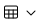
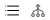

# ActionBar

> Component: ActionBar (Table Toolbar)
> CSS: `table.css` (actionbar section) | JS: `table.js` (refresh spin, state management) | HTML ref: `actionbar.html`

## ⚠ Critical Rules (READ BEFORE BUILDING)

1. **Type 8 is MANDATORY on every Reports page (Shell C).** Uses `.actionbar__btn-report` for the "+ Incident" button and alternate icons (`icon-ab-search.svg`, `icon-ab-arrow-left.svg`, `icon-ab-arrow-right.svg`). See "Type 8 — Report ActionBar" below.
2. **Types 1–7 are FORBIDDEN on Reports pages.** They use the default icon set, which is wrong for Reports.
3. **Never style the actionbar inline.** The 36px height, `#DCDCDC` separator, `#FFFFFF` background, and `6px 4px` padding are all tokenized. Redefining `.actionbar` in inline `<style>` overrides the design system.
4. **Incident button goes on the LEFT (`actionbar__left`)**, not the right. Pagination + column-view live on the right.

## Quick Summary

The **ActionBar** is the table toolbar that sits above data tables. It provides search, pagination, bulk actions, filtering, view toggle, refresh, selected count, and report-incident functionality. There are **8 variants** covering every table toolbar pattern across Log360 Cloud.

The actionbar is a flex row: `.actionbar__left` for left-aligned items (search, actions) and `.actionbar__right` for right-aligned items (pagination, nav arrows, view controls).

## Configuration

| Token | Value | Purpose |
|---|---|---|
| `--actionbar-height` | `36px` | ActionBar height |
| `--actionbar-bg` | `#FFFFFF` | Background colour |
| `--actionbar-border` | `#DCDCDC` | Separator/border colour |
| `--actionbar-icon-size` | `24px` | Icon container size |
| `--actionbar-gap` | `8px` | Item spacing |
| `--actionbar-padding` | `6px 4px` | Inner padding |
| `--actionbar-separator-height` | `16px` | Separator bar height |
| `--actionbar-pagination-font-size` | `12px` | Pagination text size |

### Action Button States (Type 2)

| State | Background |
|---|---|
| Default | `#FFFFFF` |
| Hover | `#E9E9E9` |
| Active | `#EAF0FC` |

### Report Button States (Type 8 — `.actionbar__btn-report`)

| State | Background |
|---|---|
| Default | `#FFFFFF`, 1px `#ABABAB` border, 24px height |
| Hover | `#F0F0F0` |
| Active | `#E9E9E9` |

## Required Icons

| Icon file | Purpose |
|---|---|
| `icon-actionbar-search.svg` | Search |
| `icon-ab-search.svg` | Search (alt, report variant) |
| `icon-actionbar-filter.svg` | Filter |
| `icon-chevron-left.svg` | Previous page |
| `icon-ab-arrow-left.svg` | Previous page (alt, report variant) |
| `icon-chevron-right.svg` | Next page |
| `icon-ab-arrow-right.svg` | Next page (alt, report variant) |
| `icon-actionbar-refresh.svg` | Refresh |
| `icon-ab-enable.svg` | Enable action |
| `icon-ab-disable.svg` | Disable action |
| `icon-ab-delete.svg` | Delete action |
| `icon-ab-more.svg` | More actions |
| `icon-ab-table-view.svg` | Table view type dropdown |
| `icon-ab-toggle-view.svg` | List/Consolidated toggle |
| `icon-ab-column.svg` | Column View (add/remove columns) |
| `icon-ab-plus.svg` | Plus icon for Report incident button |

## Complete HTML

### Type 1 — Search + Pagination (Minimal)

```html
<div class="actionbar">
  <div class="actionbar__left">
    <button class="actionbar__icon-btn" title="Search">
      
    </button>
  </div>
  <div class="actionbar__right">
    <span class="actionbar__pagination">1-25 <i>of</i> <b>100</b></span>
    <button class="actionbar__nav-btn" title="Previous">
      
    </button>
    <button class="actionbar__nav-btn" title="Next">
      
    </button>
  </div>
</div>
```

### Type 2 — Search + Bulk Actions (Enable/Disable/Delete/More) + Pagination

```html
<div class="actionbar">
  <div class="actionbar__left">
    <button class="actionbar__icon-btn" title="Search">
      
    </button>
    <div class="actionbar__separator"></div>
    <div class="actionbar__actions">
      <button class="actionbar__action" data-ab-action>
        
        <span>Enable</span>
      </button>
      <button class="actionbar__action" data-ab-action>
        
        <span>Disable</span>
      </button>
      <button class="actionbar__action" data-ab-action>
        
        <span>Delete</span>
      </button>
      <button class="actionbar__action actionbar__action--more" data-ab-action title="More actions">
        
      </button>
    </div>
  </div>
  <div class="actionbar__right">
    <span class="actionbar__pagination">1-25 <i>of</i> <b>100</b></span>
    <button class="actionbar__nav-btn" title="Previous">
      
    </button>
    <button class="actionbar__nav-btn" title="Next">
      
    </button>
  </div>
</div>
```

### Type 3 — Search + Pagination + Refresh

```html
<div class="actionbar">
  <div class="actionbar__left">
    <button class="actionbar__icon-btn" title="Search">
      
    </button>
  </div>
  <div class="actionbar__right">
    <span class="actionbar__pagination">1-25 <i>of</i> <b>100</b></span>
    <button class="actionbar__nav-btn" title="Previous">
      
    </button>
    <button class="actionbar__nav-btn" title="Next">
      
    </button>
    <div class="actionbar__separator"></div>
    <button class="actionbar__icon-btn" title="Refresh">
      
    </button>
  </div>
</div>
```

### Type 4 — Search + Pagination + Table View Type (Dropdown)

```html
<div class="actionbar">
  <div class="actionbar__left">
    <button class="actionbar__icon-btn" title="Search">
      
    </button>
  </div>
  <div class="actionbar__right">
    <span class="actionbar__pagination">1-25 <i>of</i> <b>100</b></span>
    <button class="actionbar__nav-btn" title="Previous">
      
    </button>
    <button class="actionbar__nav-btn" title="Next">
      
    </button>
    <div class="actionbar__separator"></div>
    <button class="actionbar__icon-btn actionbar__icon-btn--table-view" title="Table View">
      
    </button>
  </div>
</div>
```

### Type 5 — Search + Filter Dropdown ("Showing All") + Pagination

```html
<div class="actionbar">
  <div class="actionbar__left">
    <button class="actionbar__icon-btn" title="Search">
      
    </button>
  </div>
  <div class="actionbar__right">
    <div class="actionbar__filter-dropdown">
      <span>Showing</span>
      <select>
        <option>All</option>
        <option>Enabled</option>
        <option>Disabled</option>
      </select>
    </div>
    <span class="actionbar__pagination">1-25 <i>of</i> <b>100</b></span>
    <button class="actionbar__nav-btn" title="Previous">
      
    </button>
    <button class="actionbar__nav-btn" title="Next">
      
    </button>
  </div>
</div>
```

### Type 6 — Search + Pagination + Toggle View (List/Consolidated)

```html
<div class="actionbar">
  <div class="actionbar__left">
    <button class="actionbar__icon-btn" title="Search">
      
    </button>
  </div>
  <div class="actionbar__right">
    <span class="actionbar__pagination">1-25 <i>of</i> <b>100</b></span>
    <button class="actionbar__nav-btn" title="Previous">
      
    </button>
    <button class="actionbar__nav-btn" title="Next">
      
    </button>
    <div class="actionbar__separator"></div>
    <button class="actionbar__icon-btn actionbar__icon-btn--toggle" title="Toggle View">
      
    </button>
  </div>
</div>
```

### Type 7 — Search + Selected Count + Clear All + Pagination

```html
<div class="actionbar">
  <div class="actionbar__left">
    <button class="actionbar__icon-btn" title="Search">
      
    </button>
    <div class="actionbar__separator"></div>
    <div class="actionbar__selected-count">
      <span>Selected Count: <b>06</b></span>
      <button class="actionbar__clear-all">Clear All</button>
    </div>
  </div>
  <div class="actionbar__right">
    <span class="actionbar__pagination">1-25 <i>of</i> <b>100</b></span>
    <button class="actionbar__nav-btn" title="Previous">
      
    </button>
    <button class="actionbar__nav-btn" title="Next">
      
    </button>
  </div>
</div>
```

### Type 8 — Report ActionBar: Search + Incident Button + Pagination + Column View

Purpose: Specifically designed for Report data-tables across Log360 Cloud Reports tab. The "+ Incident" button on the LEFT side opens the Incident Workbench drawer.

```html
<div class="actionbar">
  <div class="actionbar__left">
    <button class="actionbar__icon-btn" title="Search">
      
    </button>
    <div class="actionbar__separator"></div>
    <button class="actionbar__btn-report" onclick="ElegantDrawer && ElegantDrawer.open('incidentWorkbenchDrawer')">
      
      <span>Incident</span>
    </button>
  </div>
  <div class="actionbar__right">
    <span class="actionbar__pagination">1-25 <i>of</i> <b>100</b></span>
    <button class="actionbar__nav-btn" title="Previous">
      
    </button>
    <button class="actionbar__nav-btn" title="Next">
      
    </button>
    <div class="actionbar__separator"></div>
    <button class="actionbar__icon-btn" title="Column View">
      
    </button>
  </div>
</div>
```

## Complete CSS

The ActionBar CSS is located inside `table.css`:

```css
/* ── ActionBar ── */
.actionbar {
  display: flex;
  align-items: center;
  justify-content: space-between;
  height: var(--actionbar-height);               /* 36px */
  border-top: 1px solid #E9E9E9;                 /* Figma: strokeTop only */
  background: var(--actionbar-bg);
  padding: 6px 4px;                              /* Figma: padding 6 4 6 4 */
}

.actionbar__left,
.actionbar__right {
  display: flex;
  align-items: center;
  gap: 8px;                                       /* Figma: itemSpacing 8 */
}

.actionbar__icon-btn {
  width: 24px;
  height: 24px;
  display: flex;
  align-items: center;
  justify-content: center;
  border: none;
  background: transparent;
  cursor: pointer;
  border-radius: 3px;
  padding: 0;
  transition: background 0.12s;
}
.actionbar__icon-btn:hover {
  background: var(--table-header-bg);
}
.actionbar__icon-btn img,
.actionbar__icon-btn svg {
  width: 24px;
  height: 24px;
}

/* View-type combined icon (grid + dropdown arrow) */
.actionbar__icon-btn--view img,
.actionbar__icon-btn--view svg {
  width: 42px;
  height: 24px;
}
.actionbar__icon-btn--view {
  width: auto;
}

.actionbar__separator {
  width: 1px;
  height: 16px;
  background: var(--actionbar-border);
  flex-shrink: 0;
}

.actionbar__pagination {
  font-size: var(--actionbar-pagination-font-size);
  color: var(--sidebar-text-secondary);
  white-space: nowrap;
}
.actionbar__pagination b {
  color: var(--table-text-primary);
  font-weight: 600;
}
.actionbar__pagination i {
  font-style: italic;
}

/* Pagination prev/next arrows (24x24) */
.actionbar__nav-btn {
  width: 24px;
  height: 24px;
  display: flex;
  align-items: center;
  justify-content: center;
  border: none;
  background: transparent;
  cursor: pointer;
  padding: 0;
}
.actionbar__nav-btn img,
.actionbar__nav-btn svg {
  width: 14px;
  height: 14px;
}

/* ── Report ActionBar Primary Button (Type 8) ──
   Outlined secondary-style button with icon + label,
   used on the LEFT side of report-page action bars.
   Default use: "+ Incident" to trigger Incident Workbench.
   Also reusable for "+ Export", "+ Save View", etc. */
.actionbar__btn-report {
  height: 24px;
  border: 1px solid #ABABAB;
  border-radius: 2px;
  padding: 5px 16px;
  font-size: 12px;
  font-family: var(--font-family);
  background: #FFFFFF;
  color: #000000;
  cursor: pointer;
  display: inline-flex;
  align-items: center;
  gap: 8px;
  white-space: nowrap;
  box-sizing: border-box;
  transition: background 0.12s;
}
.actionbar__btn-report:hover {
  background: #F0F0F0;
}
.actionbar__btn-report:active {
  background: #E9E9E9;
}
.actionbar__btn-report img,
.actionbar__btn-report svg {
  width: 12px;
  height: 12px;
  flex-shrink: 0;
}

/* ── ActionBar Bulk Actions (Type 2) ── */
.actionbar__actions {
  display: flex;
  align-items: center;
  gap: 4px;
}
.actionbar__action {
  display: flex;
  align-items: center;
  gap: 6px;
  padding: 5px 8px;
  border: none;
  background: #fff;
  cursor: pointer;
  font-family: inherit;
  font-size: 12px;
  color: #000;
  border-radius: 2px;
  white-space: nowrap;
  transition: background 0.12s;
}
.actionbar__action:hover {
  background: #E9E9E9;
}
.actionbar__action.actionbar__action--active {
  background: #EAF0FC;
}
.actionbar__action img,
.actionbar__action svg {
  width: 14px;
  height: 14px;
  flex-shrink: 0;
}
.actionbar__action--more {
  padding: 5px 6px;
}
.actionbar__action--more img,
.actionbar__action--more svg {
  width: 14px;
  height: 14px;
}

/* ── ActionBar Selected Count (Type 7) ── */
.actionbar__selected-count {
  display: flex;
  align-items: center;
  gap: 8px;
  font-size: 12px;
  color: #000;
  white-space: nowrap;
}
.actionbar__selected-count b {
  font-weight: 600;
}
.actionbar__clear-all {
  border: none;
  background: transparent;
  cursor: pointer;
  font-family: inherit;
  font-size: 12px;
  color: var(--link-color);
  padding: 0;
}
.actionbar__clear-all:hover {
  text-decoration: underline;
}

/* ── ActionBar Filter Dropdown (Type 5) ── */
.actionbar__filter-dropdown {
  display: flex;
  align-items: center;
  gap: 6px;
  font-size: 12px;
  color: #000;
  white-space: nowrap;
}
.actionbar__filter-dropdown select {
  border: 1px solid #DCDCDC;
  border-radius: 3px;
  font-family: inherit;
  font-size: 12px;
  padding: 2px 20px 2px 6px;
  height: 24px;
  background: #fff;
  cursor: pointer;
  appearance: auto;
}

/* ── ActionBar Toggle View (Type 6) ── */
.actionbar__icon-btn--toggle {
  width: auto;
}
.actionbar__icon-btn--toggle img,
.actionbar__icon-btn--toggle svg {
  width: 50px;
  height: 20px;
}

/* ── ActionBar Table View Type (Type 4) ── */
.actionbar__icon-btn--table-view {
  width: auto;
}
.actionbar__icon-btn--table-view img,
.actionbar__icon-btn--table-view svg {
  width: 42px;
  height: 24px;
}
```

## JavaScript API

The ActionBar is managed by `table.js` which handles:
- Refresh button spin animation
- Action bar state management (enable/disable bulk actions based on selection)
- Search expand/collapse
- Pagination state updates

No standalone JS API is needed — the HTML structure + CSS handles all visual states. Interactivity is wired via `table.js` event listeners on `[data-ab-action]` elements and the refresh icon.

## Variants

| Type | Description | Left Side | Right Side |
|---|---|---|---|
| 1 | Minimal | Search | Pagination + Nav |
| 2 | Bulk Actions | Search + Separator + Enable/Disable/Delete/More | Pagination + Nav |
| 3 | With Refresh | Search | Pagination + Nav + Separator + Refresh |
| 4 | Table View Type | Search | Pagination + Nav + Separator + Table View Dropdown |
| 5 | Filter Dropdown | Search | Filter Dropdown + Pagination + Nav |
| 6 | Toggle View | Search | Pagination + Nav + Separator + Toggle View |
| 7 | Selected Count | Search + Separator + Selected Count + Clear All | Pagination + Nav |
| 8 | Report ActionBar | Search + Separator + Incident Button | Pagination + Nav + Separator + Column View |

## Assembly Notes

1. The ActionBar sits **above** the data table, inside `.main-content`. Use `border-top: 1px solid #E9E9E9` (not `border-bottom`) — it visually separates from the header above.
2. CSS lives in `table.css`, not a standalone file — load `tokens.css` + `table.css`.
3. Pagination text format: `1-25 <i>of</i> <b>100</b>` — italicised "of", bold total count.
4. Type 8 is **mandatory** for all Report data-table pages. It uses alternate icon variants (`icon-ab-search.svg`, `icon-ab-arrow-left/right.svg`) and the `.actionbar__btn-report` button.
5. The `.actionbar__separator` is a 1px × 16px vertical divider used to group related controls.
6. For sticky behaviour inside scrollable tables, wrap in `.table-scroll-area` — the actionbar gets `position: sticky; top: 0; z-index: 3`.
7. Bulk action buttons (Type 2) use `data-ab-action` attribute for JS binding.
8. The "Clear All" link in Type 7 uses `var(--link-color)` (`#006AFF`) and underlines on hover.
