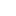

# TopNavBar

> Component: TopNavBar | Height: 78px (Row1=44 + Row2=34)
> CSS: `topnavbar.css` | JS: `topnavbar.js` | HTML ref: `topnavbar.html`

## Quick Summary

The TopNavBar is the primary navigation header for the Log360 Cloud application shell. It renders two stacked rows — Row 1 (44px) contains the brand logo, subscription badge, notification icons, user avatar, and apps grid; Row 2 (34px) contains horizontal navigation tabs, a "Log Search" input, and an "Add" button. It supports Priority+ responsive overflow: on viewports ≤1024px, tabs that don't fit are hidden and accessible via a "..." more button that opens a bottom sheet.

## Configuration

Set `data-active-tab="TabName"` on the `<header class="topnavbar">` element. The JS (`topnavbar.js`) reads this attribute on page load and automatically applies the `topnavbar__tab--selected` class to the matching tab. All tabs start as `--unselected` in the HTML — no manual class editing is needed.

**Available tab names** (case-sensitive, must match text content exactly):

| Tab Name               |
|------------------------|
| Home                   |
| Reports                |
| Compliance             |
| Search                 |
| Security               |
| Alerts                 |
| Cloud Protection       |
| Settings               |
| LogMe                  |
| Support                |
| Top Blocked Countries  |

**Example usage:**

```html
<header class="topnavbar" data-active-tab="Settings">
<header class="topnavbar" data-active-tab="Reports">
<header class="topnavbar" data-active-tab="Dashboard">
```

## Required Icons

| Icon file                        | Purpose                        | Size / Notes                                       |
|----------------------------------|--------------------------------|----------------------------------------------------|
| `assets/icons/icon-menu.svg`     | Hamburger menu button          | 20×20, white strokes                               |
| `assets/icons/icon-ab-more.svg`  | "..." more-tabs button         | 18×18, uses `filter:brightness(10)` for white      |
| `assets/icons/logo-log360.svg`   | Brand logo icon                | Sized via `--logo-icon-size` CSS variable           |
| `assets/icons/icon-notification.svg` | Notification / Alert bell  | 16×16 (used twice: Notifications + Alerts)         |
| `assets/icons/icon-question.svg` | Help button                    | 16×16                                              |
| `assets/icons/icon-user-avatar.svg` | User avatar                 | Sized via `--icon-container-size` CSS variable      |
| `assets/icons/icon-apps-grid.svg`| Apps grid button               | 16×16                                              |
| `assets/icons/icon-search.svg`   | Search input magnifier         | 14×14                                              |
| `assets/icons/icon-plus.svg`     | Add button plus icon           | 10×10                                              |

**Icon priority rule:** (1) `assets/icons/` local SVGs FIRST → (2) Lucide CDN ONLY for 48px tile icons needing dynamic color. NEVER use Lucide CDN when a local icon exists.

## Complete HTML

```html
<!--
  ============================================================
  TOPNAVBAR — Predefined HTML Component
  ============================================================
  Height: 78px (Row1=44 + Row2=34)

  CONFIGURATION (data- attribute):
  ─────────────────────────────────
  Set data-active-tab="TabName" on the <header> element.
  The JS (topnavbar.js) reads this attribute on page load and
  automatically applies topnavbar__tab--selected to the matching tab.
  All tabs start as --unselected in the HTML — no manual class editing needed.

  AVAILABLE TAB NAMES (case-sensitive, must match text exactly):
    Home | Reports | Compliance | Search | Security
    Alerts | Cloud Protection | Settings | LogMe | Support
    Top Blocked Countries

  EXAMPLE:
    <header class="topnavbar" data-active-tab="Settings">
    <header class="topnavbar" data-active-tab="Reports">
    <header class="topnavbar" data-active-tab="Dashboard">

  RESPONSIVE — Priority+ Navigation (mobile/tablet):
  As the screen shrinks below 1024px, tabs overflow one by one
  from the right. The active tab is ALWAYS kept visible.
  Overflowed tabs are pushed to the "..." bottom sheet.
  The "..." button auto-appears when any tab overflows.
  User can click visible tabs directly, or click "..." to see
  the rest and switch from the bottom sheet.
  The bottom sheet HTML must also be included (see nav-bottom-sheet below).

  ICONS:
    Uses LOCAL Figma-exported SVG icons from assets/icons/.
    Hamburger:  (white strokes)
    More tabs:  (with filter:brightness(10) for white)
    ICON PRIORITY: (1) assets/icons/ local SVGs FIRST → (2) Lucide CDN ONLY for
    48px tile icons needing dynamic color. NEVER use Lucide CDN when a local icon exists.

  CSS:  tokens.css + topnavbar.css + responsive.css
  JS:   topnavbar.js  (reads data-active-tab + click switching + bottom sheet)
  ============================================================
-->

<header class="topnavbar" data-active-tab="Settings">

  <!-- Row 1: Brand Bar (h=44, bg=#272D42) -->
  <div class="topnavbar__row1">
      <div class="topnavbar__row1-container">
        <button class="topnavbar__hamburger" title="Menu" aria-label="Toggle navigation">
          
        </button>
        <a href="#" class="topnavbar__logo">
          
          <span class="topnavbar__logo-text">Log360 Cloud</span>
        </a>

      <div class="topnavbar__right">
        <span class="topnavbar__subscription">Subscription</span>
        <div class="topnavbar__divider"></div>

        <div class="topnavbar__icons">
          <button class="topnavbar__icon-btn" title="Notifications">
            
            <span class="topnavbar__badge topnavbar__badge--blue">8</span>
          </button>
          <button class="topnavbar__icon-btn" title="Alerts">
            
            <span class="topnavbar__badge topnavbar__badge--red">9+</span>
          </button>
          <button class="topnavbar__icon-btn" title="Help">
            
          </button>
        </div>

        <button class="topnavbar__avatar" title="Account">
          
        </button>

        <button class="topnavbar__grid" title="Apps">
          
        </button>
      </div>
    </div>
  </div>

  <!-- Row 2: Nav Tabs + Search (h=34, bg=#343B52) -->
  <div class="topnavbar__row2">
    <div class="topnavbar__row2-container">
      <nav class="topnavbar__tabs">
        <a href="#" class="topnavbar__tab topnavbar__tab--unselected">Home</a>
        <a href="#" class="topnavbar__tab topnavbar__tab--unselected">Reports</a>
        <a href="#" class="topnavbar__tab topnavbar__tab--unselected">Compliance</a>
        <a href="#" class="topnavbar__tab topnavbar__tab--unselected">Search</a>
        <a href="#" class="topnavbar__tab topnavbar__tab--unselected">Security</a>
        <a href="#" class="topnavbar__tab topnavbar__tab--unselected">Alerts</a>
        <a href="#" class="topnavbar__tab topnavbar__tab--unselected">Cloud Protection</a>
        <a href="#" class="topnavbar__tab topnavbar__tab--unselected">Settings</a>
        <a href="#" class="topnavbar__tab topnavbar__tab--unselected">LogMe</a>
        <a href="#" class="topnavbar__tab topnavbar__tab--unselected">Support</a>
        <a href="#" class="topnavbar__tab topnavbar__tab--unselected">Top Blocked Countries</a>
      </nav>
      <button class="topnavbar__more" title="More tabs" aria-label="Show all tabs">
        
      </button>

      <div class="topnavbar__segment">
        <div class="topnavbar__search">
          
          <input type="text" placeholder="Log Search" />
        </div>
        <button class="topnavbar__add-btn">
          
          <span>Add</span>
        </button>
      </div>
    </div>
  </div>
</header>

<!--
  NAV BOTTOM SHEET — Place this OUTSIDE <div class="app-shell">, right before <script> tags.
  The JS (topnavbar.js) auto-syncs the active item with data-active-tab.
-->
<div class="nav-bottom-sheet" id="navBottomSheet">
  <div class="nav-bottom-sheet__backdrop"></div>
  <div class="nav-bottom-sheet__panel">
    <div class="nav-bottom-sheet__handle"></div>
    <ul class="nav-bottom-sheet__list">
      <li><button class="nav-bottom-sheet__item" data-tab="Home">Home</button></li>
      <li><button class="nav-bottom-sheet__item" data-tab="Reports">Reports</button></li>
      <li><button class="nav-bottom-sheet__item" data-tab="Compliance">Compliance</button></li>
      <li><button class="nav-bottom-sheet__item" data-tab="Search">Search</button></li>
      <li><button class="nav-bottom-sheet__item" data-tab="Security">Security</button></li>
      <li><button class="nav-bottom-sheet__item" data-tab="Alerts">Alerts</button></li>
      <li><button class="nav-bottom-sheet__item" data-tab="Cloud Protection">Cloud Protection</button></li>
      <li><button class="nav-bottom-sheet__item" data-tab="Settings">Settings</button></li>
      <li><button class="nav-bottom-sheet__item" data-tab="LogMe">LogMe</button></li>
      <li><button class="nav-bottom-sheet__item" data-tab="Support">Support</button></li>
      <li><button class="nav-bottom-sheet__item" data-tab="Top Blocked Countries">Top Blocked Countries</button></li>
    </ul>
  </div>
</div>
```

## Complete CSS

```css
/* ============================================================
   TOPNAVBAR — Captured from Figma MCP
   Structure: Row1 (logo + icons) | Row2 (nav tabs + search)
   Total height: 78px (44 + 34)
   ============================================================ */

.topnavbar {
  display: flex;
  flex-direction: column;
  width: 100%;
  height: 78px;
  flex-shrink: 0;
}

/* ── Row 1: Brand bar (h=44) ── */
.topnavbar__row1 {
  height: var(--topnav-row1-height);
  background: var(--topnav-row1-bg);
  padding: var(--topnav-row1-padding);
  display: flex;
  align-items: center;
}

.topnavbar__row1-container {
  display: flex;
  align-items: center;
  justify-content: space-between;
  width: 100%;
  height: 100%;
}

/* Logo area */
.topnavbar__logo {
  display: flex;
  align-items: center;
  gap: var(--logo-area-gap);
  padding: var(--logo-area-padding);
  text-decoration: none;
  height: 100%;
}

.topnavbar__logo-icon {
  width: var(--logo-icon-size);
  height: var(--logo-icon-size);
  flex-shrink: 0;
}

.topnavbar__logo-text {
  color: var(--logo-color);
  font-size: var(--logo-font-size);
  font-weight: var(--logo-font-weight);
  white-space: nowrap;
  line-height: 1;
}

/* Right section: Subscription + divider + icons + avatar + grid */
.topnavbar__right {
  display: flex;
  align-items: center;
  gap: 12px;
  height: 100%;
  flex-shrink: 0;
}

.topnavbar__subscription {
  background: var(--subscription-bg);
  padding: var(--subscription-padding);
  border-radius: var(--subscription-radius);
  color: var(--subscription-text);
  font-size: var(--subscription-font-size);
  white-space: nowrap;
  line-height: 1;
}

.topnavbar__divider {
  width: 1px;
  height: 16px;
  background: rgba(255, 255, 255, 0.2);
  flex-shrink: 0;
}

/* Icon container (notification, help) */
.topnavbar__icons {
  display: flex;
  align-items: center;
  gap: var(--icon-gap);
}

.topnavbar__icon-btn {
  position: relative;
  display: flex;
  align-items: center;
  justify-content: center;
  width: var(--icon-container-size);
  height: var(--icon-container-size);
  border-radius: var(--icon-container-radius);
  border: none;
  background: transparent;
  cursor: pointer;
  transition: background 0.15s;
  padding: 0;
}
.topnavbar__icon-btn:hover {
  background: var(--icon-container-hover-bg);
}

.topnavbar__icon-btn svg,
.topnavbar__icon-btn img {
  width: 16px;
  height: 16px;
}

.topnavbar__badge {
  position: absolute;
  top: 2px;
  right: 2px;
  min-width: 16px;
  height: 16px;
  border-radius: var(--badge-radius);
  font-size: var(--badge-font-size);
  font-weight: 700;
  color: var(--badge-text);
  display: flex;
  align-items: center;
  justify-content: center;
  line-height: 1;
  padding: 0 3px;
}
.topnavbar__badge--blue { background: var(--badge-blue); }
.topnavbar__badge--red  { background: var(--badge-red); }

/* Avatar */
.topnavbar__avatar {
  width: var(--icon-container-size);
  height: var(--icon-container-size);
  border-radius: 50%;
  overflow: hidden;
  border: none;
  background: transparent;
  cursor: pointer;
  padding: 0;
  flex-shrink: 0;
}
.topnavbar__avatar img,
.topnavbar__avatar svg {
  width: 100%;
  height: 100%;
  display: block;
}

/* Apps grid icon */
.topnavbar__grid {
  display: flex;
  align-items: center;
  justify-content: center;
  width: 16px;
  height: 16px;
  border: none;
  background: transparent;
  cursor: pointer;
  padding: 0;
  flex-shrink: 0;
}
.topnavbar__grid img,
.topnavbar__grid svg {
  width: 16px;
  height: 16px;
}

/* ── Row 2: Nav tabs + Search (h=34) ── */
.topnavbar__row2 {
  height: var(--topnav-row2-height);
  background: var(--topnav-row2-bg);
  padding: var(--topnav-row2-padding);
  display: flex;
  align-items: center;
}

.topnavbar__row2-container {
  display: flex;
  align-items: center;
  justify-content: space-between;
  width: 100%;
  height: 100%;
}

/* Nav tabs slider */
.topnavbar__tabs {
  display: flex;
  align-items: center;
  height: 100%;
  flex: 1;
  min-width: 0;
  overflow: hidden;
}

.topnavbar__tab {
  display: flex;
  align-items: center;
  justify-content: center;
  height: var(--nav-tab-height);
  padding: var(--nav-tab-padding);
  font-size: var(--nav-tab-font-size);
  font-weight: var(--nav-tab-font-weight);
  text-decoration: none;
  white-space: nowrap;
  transition: background 0.15s, color 0.15s;
  cursor: pointer;
  border: none;
  font-family: inherit;
  line-height: 1;
}

.topnavbar__tab--unselected {
  background: var(--nav-tab-unselected-bg);
  color: var(--nav-tab-unselected-text);
}
.topnavbar__tab--unselected:hover {
  background: #3d4460;
  color: #eeeef2;
}

.topnavbar__tab--selected {
  background: var(--nav-tab-selected-bg);
  color: var(--nav-tab-selected-text);
}

/* Search + Add segment */
.topnavbar__segment {
  display: flex;
  align-items: center;
  gap: 8px;
  flex-shrink: 0;
}

.topnavbar__search {
  display: flex;
  align-items: center;
  width: var(--search-width);
  height: var(--search-height);
  border: 1px solid var(--search-stroke);
  border-radius: var(--search-radius);
  padding: var(--search-padding);
  gap: 6px;
}
.topnavbar__search svg {
  width: 14px;
  height: 14px;
  flex-shrink: 0;
}
.topnavbar__search input {
  background: transparent;
  border: none;
  outline: none;
  color: #FFFFFF;
  font-size: var(--search-font-size);
  font-family: inherit;
  width: 100%;
  line-height: 1;
}
.topnavbar__search input::placeholder {
  color: var(--search-placeholder);
}

/* ── Disabled tab state — non-clickable tabs for single-page builds ── */
.topnavbar__tab--disabled {
  pointer-events: none;
  opacity: 0.5;
  cursor: not-allowed;
}
.topnavbar__tab--disabled:hover,
.topnavbar__tab--disabled:focus {
  background: transparent;
  text-decoration: none;
}

.topnavbar__add-btn {
  display: flex;
  align-items: center;
  gap: var(--add-btn-gap);
  height: var(--add-btn-height);
  padding: var(--add-btn-padding);
  background: var(--add-btn-bg);
  border: none;
  border-radius: var(--add-btn-radius);
  color: #FFFFFF;
  font-size: var(--add-btn-font-size);
  font-family: inherit;
  cursor: pointer;
  white-space: nowrap;
  transition: background 0.15s;
}
.topnavbar__add-btn:hover {
  background: #7d86a8;
}
.topnavbar__add-btn svg,
.topnavbar__add-btn img {
  width: 10px;
  height: 10px;
  flex-shrink: 0;
}
```

## JavaScript API

```js
/* ============================================================
   TOPNAVBAR — Predefined JavaScript
   Priority+ Navigation: shows as many tabs as fit, always
   keeps the active tab visible, overflows the rest to "...".
   On desktop (>1024px) all tabs are visible, no overflow.

   Include via: <script src="../predefined-components/topnavbar.js"></script>
   ============================================================ */

(function () {
  'use strict';

  var DESKTOP_BREAKPOINT = 1024;
  var MORE_BTN_WIDTH = 38;
  var _resizeTimer = null;

  /* ── Set data-active-tab and apply classes ── */
  function setActiveTab(name) {
    var header = document.querySelector('.topnavbar');
    var tabs   = document.querySelectorAll('.topnavbar__tab');

    tabs.forEach(function (t) {
      if (t.textContent.trim() === name) {
        t.classList.remove('topnavbar__tab--unselected');
        t.classList.add('topnavbar__tab--selected');
      } else {
        t.classList.remove('topnavbar__tab--selected');
        t.classList.add('topnavbar__tab--unselected');
      }
    });

    if (header) header.setAttribute('data-active-tab', name);

    syncBottomSheetActive(name);
    computeOverflow();
  }

  /* ── Apply data-active-tab on load ── */
  function initNavTabs() {
    var header = document.querySelector('.topnavbar');
    var tabs   = document.querySelectorAll('.topnavbar__tab');
    if (!header || !tabs.length) return;

    var activeTabName = header.getAttribute('data-active-tab');
    if (activeTabName) {
      tabs.forEach(function (tab) {
        if (tab.textContent.trim() === activeTabName) {
          tab.classList.remove('topnavbar__tab--unselected');
          tab.classList.add('topnavbar__tab--selected');
        } else {
          tab.classList.remove('topnavbar__tab--selected');
          tab.classList.add('topnavbar__tab--unselected');
        }
      });
    }

    tabs.forEach(function (tab) {
      tab.addEventListener('click', function (e) {
        e.preventDefault();
        setActiveTab(tab.textContent.trim());
      });
    });
  }

  /* ══════════════════════════════════════════════════════════
     PRIORITY+ OVERFLOW ENGINE
     Measures which tabs fit in the available space.
     Active tab is always guaranteed visible.
     Overflowed tabs get .topnavbar__tab--overflow class.
     "..." button appears only when there are hidden tabs.
     ══════════════════════════════════════════════════════════ */
  function computeOverflow() {
    var tabsContainer = document.querySelector('.topnavbar__tabs');
    var moreBtn       = document.querySelector('.topnavbar__more');
    var tabs          = document.querySelectorAll('.topnavbar__tab');
    var header        = document.querySelector('.topnavbar');
    if (!tabsContainer || !tabs.length) return;

    var isDesktop = window.innerWidth > DESKTOP_BREAKPOINT;

    if (isDesktop) {
      tabs.forEach(function (t) { t.classList.remove('topnavbar__tab--overflow'); });
      if (moreBtn) moreBtn.classList.remove('topnavbar__more--visible');
      syncBottomSheet([]);
      return;
    }

    var activeTabName = header ? header.getAttribute('data-active-tab') : '';

    tabs.forEach(function (t) { t.classList.remove('topnavbar__tab--overflow'); });

    var containerWidth = tabsContainer.offsetWidth;
    var budgetWithMore = containerWidth - MORE_BTN_WIDTH;
    var budgetNoMore   = containerWidth;

    var tabWidths = [];
    tabs.forEach(function (t) {
      tabWidths.push({ el: t, width: t.offsetWidth, name: t.textContent.trim() });
    });

    var usedWidth = 0;
    var fitsCount = 0;
    for (var i = 0; i < tabWidths.length; i++) {
      if (usedWidth + tabWidths[i].width <= budgetNoMore) {
        usedWidth += tabWidths[i].width;
        fitsCount++;
      } else {
        break;
      }
    }

    if (fitsCount === tabWidths.length) {
      if (moreBtn) moreBtn.classList.remove('topnavbar__more--visible');
      syncBottomSheet([]);
      return;
    }

    usedWidth = 0;
    var visibleSet = [];
    var overflowSet = [];

    for (var j = 0; j < tabWidths.length; j++) {
      if (usedWidth + tabWidths[j].width <= budgetWithMore) {
        usedWidth += tabWidths[j].width;
        visibleSet.push(tabWidths[j]);
      } else {
        overflowSet.push(tabWidths[j]);
      }
    }

    var activeInVisible = visibleSet.some(function (v) { return v.name === activeTabName; });

    if (!activeInVisible) {
      var activeEntry = null;
      var newOverflow = [];
      overflowSet.forEach(function (o) {
        if (o.name === activeTabName) {
          activeEntry = o;
        } else {
          newOverflow.push(o);
        }
      });

      if (activeEntry) {
        while (visibleSet.length > 0 && usedWidth + activeEntry.width > budgetWithMore) {
          var removed = visibleSet.pop();
          usedWidth -= removed.width;
          newOverflow.unshift(removed);
        }
        visibleSet.push(activeEntry);
        overflowSet = newOverflow;
      }
    }

    var overflowNames = overflowSet.map(function (o) { return o.name; });

    tabs.forEach(function (t) {
      var tName = t.textContent.trim();
      if (overflowNames.indexOf(tName) !== -1) {
        t.classList.add('topnavbar__tab--overflow');
      } else {
        t.classList.remove('topnavbar__tab--overflow');
      }
    });

    if (moreBtn) {
      if (overflowNames.length > 0) {
        moreBtn.classList.add('topnavbar__more--visible');
      } else {
        moreBtn.classList.remove('topnavbar__more--visible');
      }
    }

    syncBottomSheet(overflowNames);
  }

  /* ── Sync bottom sheet: show only overflowed tabs ── */
  function syncBottomSheet(overflowNames) {
    var items = document.querySelectorAll('.nav-bottom-sheet__item');
    items.forEach(function (item) {
      var li = item.closest('li');
      var tabName = item.getAttribute('data-tab');
      if (overflowNames.length === 0) {
        if (li) li.style.display = '';
        return;
      }
      if (overflowNames.indexOf(tabName) !== -1) {
        if (li) li.style.display = '';
      } else {
        if (li) li.style.display = 'none';
      }
    });
  }

  function syncBottomSheetActive(activeTabName) {
    var items = document.querySelectorAll('.nav-bottom-sheet__item');
    items.forEach(function (item) {
      if (item.getAttribute('data-tab') === activeTabName) {
        item.classList.add('nav-bottom-sheet__item--active');
      } else {
        item.classList.remove('nav-bottom-sheet__item--active');
      }
    });
  }

  /* ── Bottom Sheet open/close ── */
  function initBottomSheet() {
    var moreBtn  = document.querySelector('.topnavbar__more');
    var sheet    = document.getElementById('navBottomSheet');
    if (!moreBtn || !sheet) return;

    var backdrop = sheet.querySelector('.nav-bottom-sheet__backdrop');
    var items    = sheet.querySelectorAll('.nav-bottom-sheet__item');
    var header   = document.querySelector('.topnavbar');

    function openSheet() {
      var activeTabName = header ? header.getAttribute('data-active-tab') : '';
      syncBottomSheetActive(activeTabName);
      sheet.classList.add('nav-bottom-sheet--open');
      document.body.style.overflow = 'hidden';
    }

    function closeSheet() {
      sheet.classList.remove('nav-bottom-sheet--open');
      document.body.style.overflow = '';
    }

    moreBtn.addEventListener('click', function () {
      if (sheet.classList.contains('nav-bottom-sheet--open')) {
        closeSheet();
      } else {
        openSheet();
      }
    });

    if (backdrop) {
      backdrop.addEventListener('click', closeSheet);
    }

    items.forEach(function (item) {
      item.addEventListener('click', function () {
        var tabName = item.getAttribute('data-tab');
        setActiveTab(tabName);
        closeSheet();
      });
    });
  }

  /* ── Resize handler: debounced recompute ── */
  function onResize() {
    clearTimeout(_resizeTimer);
    _resizeTimer = setTimeout(computeOverflow, 80);
  }

  /* ── Bootstrap ── */
  function init() {
    initNavTabs();
    initBottomSheet();
    computeOverflow();
    window.addEventListener('resize', onResize);
  }

  if (document.readyState === 'loading') {
    document.addEventListener('DOMContentLoaded', init);
  } else {
    init();
  }
})();
```

## Variants

### Tab States

| Class                          | Description                                                                 |
|--------------------------------|-----------------------------------------------------------------------------|
| `topnavbar__tab--unselected`   | Default state. Transparent background, muted text (`var(--nav-tab-unselected-text)`). On hover → `#3d4460` bg, `#eeeef2` text. |
| `topnavbar__tab--selected`     | Active tab. Background `var(--nav-tab-selected-bg)`, text `var(--nav-tab-selected-text)`. Applied automatically by JS from `data-active-tab`. |
| `topnavbar__tab--disabled`     | Non-clickable tab for single-page builds. `pointer-events: none`, `opacity: 0.5`. Hover/focus styles suppressed. |
| `topnavbar__tab--overflow`     | Applied by the Priority+ overflow engine to tabs that don't fit. Hidden via the overflow engine (not `display:none` — uses the container's `overflow:hidden`). |

### Badge Variants

| Class                       | Description                                      |
|-----------------------------|--------------------------------------------------|
| `topnavbar__badge--blue`    | Blue notification count badge (`var(--badge-blue)`) |
| `topnavbar__badge--red`     | Red alert count badge (`var(--badge-red)`)          |

### Responsive Behavior: Priority+ Navigation

- **Desktop (>1024px):** All tabs visible. "..." button hidden. Bottom sheet not used.
- **Tablet/Mobile (≤1024px):** Tabs overflow from right to left. The overflow engine:
  1. Measures each tab's `offsetWidth`.
  2. Fills the container left-to-right, reserving 38px for the "..." button.
  3. If the active tab would be overflowed, it bumps visible tabs to make room — the active tab is **always** kept visible.
  4. Overflowed tabs get `.topnavbar__tab--overflow` and are hidden by the container's `overflow: hidden`.
  5. The "..." button (`.topnavbar__more`) gains `.topnavbar__more--visible`.
  6. Clicking "..." opens the bottom sheet showing only the overflowed tabs.
  7. Selecting a tab from the bottom sheet calls `setActiveTab()`, closes the sheet, and recomputes overflow.
- **Resize:** Debounced at 80ms via `setTimeout`.

### Bottom Sheet

The bottom sheet (`#navBottomSheet`) is a companion element that lives **outside** the `.app-shell` div. It contains all 11 tab names as `<button>` elements with `data-tab` attributes. The JS syncs visibility (only overflowed tabs shown) and active state (`.nav-bottom-sheet__item--active`) automatically.

## Assembly Notes

1. **Placement in shell:** The `<header class="topnavbar">` must be the **first child** of `.app-shell`.
2. **Bottom sheet placement:** The `<div class="nav-bottom-sheet" id="navBottomSheet">` goes **outside** `.app-shell`, right before the `<script>` tags at the end of `<body>`.
3. **Required CSS files:** Load in order: `tokens.css` → `topnavbar.css` → `responsive.css`.
4. **Required JS file:** `topnavbar.js` — include via `<script src="..."></script>` after the bottom sheet markup.
5. **Icon path corrections:** The HTML references icons using two relative path patterns:
   - `./assets/icons/` — for icons relative to the current HTML file (hamburger, more button).
   - `../assets/icons/` — for icons one directory up (logo, notifications, search, etc.).
   - When assembling, adjust these paths so they resolve correctly from your output HTML's location. Typical pattern: `assets/icons/filename.svg` relative to the HTML file.
6. **CSS custom properties:** The CSS relies on design-token variables (e.g., `--topnav-row1-height`, `--topnav-row1-bg`, `--nav-tab-selected-bg`, etc.) defined in `tokens.css`. These must be loaded first.
7. **Changing the active tab:** Set `data-active-tab="TabName"` on the `<header>` element. The JS handles all class toggling automatically on load.
8. **Disabling tabs:** For single-page builds where only one tab is functional, add `topnavbar__tab--disabled` alongside `topnavbar__tab--unselected` on the non-functional tabs to prevent clicks and visually dim them.
